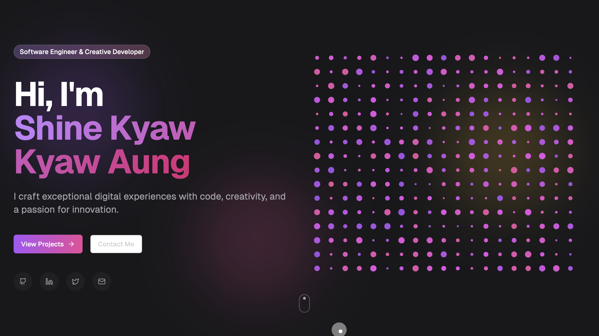

# Creative Portfolio

A modern, responsive portfolio built with Next.js 15 and Tailwind CSS. The project showcases interactive components generated with [v0.dev](https://v0.dev) and includes sections for skills, projects, experience and a contact form.



## Features

- Animated hero section with typewriter effects
- Floating navigation that appears on scroll
- Skill badges and experience timeline
- Project cards with links to demos and repositories
- Contact form with toast notifications
- Scroll progress indicator and mouse follower animation

## Technologies Used

- [Next.js](https://nextjs.org/) 15 with React 19
- [Tailwind CSS](https://tailwindcss.com/)
- [Framer Motion](https://www.framer.com/motion/) for animations
- [Radix UI](https://www.radix-ui.com/) components
- [TypeScript](https://www.typescriptlang.org/)

## Getting Started

1. **Clone the repository**
   ```bash
   git clone <your-repo-url>
   cd <project-folder>
   ```
2. **Install dependencies**
   ```bash
   npm install
   ```
3. **Start the development server**
   ```bash
   npm run dev
   ```
4. Open [http://localhost:3000](http://localhost:3000) to view the site.

You can run `npm run lint` to check code quality.

## Customization

- Update content in the components under `components/`
- Replace images in the `public` folder
- Adjust colors and fonts in `tailwind.config.ts`
- Edit metadata in `app/layout.tsx`

## Deployment

Deploy your own copy on [Vercel](https://vercel.com):

1. Fork this repository
2. Create a new project in Vercel and import the repo
3. Click **Deploy**

## License

Released under the [MIT License](./LICENSE).
